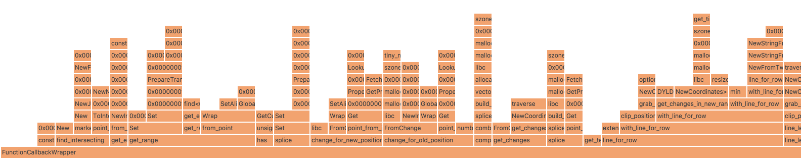

flame-graph
===========

[](https://travis-ci.org/maxbrunsfeld/node-flame-graph)

This library makes it easy to profile a process with [`dtrace`](https://en.wikipedia.org/wiki/DTrace) on macOS and to format the results as a [Flame Graph](https://queue.acm.org/detail.cfm?id=2927301).



To use this tool within [Atom](https://atom.io), try the [flame-graph](https://github.com/maxbrunsfeld/atom-flame-graph) Atom package.

## Installation

```sh
npm install @maxbrunsfeld/flame-graph
```

## Command Line Usage

To profile a running process:

```sh
$ generate-flame-graph -p $PID_TO_PROFILE
```

To stop profiling, kill the process with <kbd>Control</kbd>+<kbd>C</kbd>.

To create and profile a child process with a given command:

```sh
$ generate-flame-graph -c './test arg1 arg2'
```

Often, you're only interested in profiling a certain function (or functions). You can do this using the optional `-f`/`--functions` flag:

```sh
$ generate-flame-graph -p $PID --functions 'function1 function2'
```

## Programmatic Usage

All of the functionality shown above is accessible programatically.

```js
const {
  generateFlameGraphForCommand,
  generateFlameGraphForProcess
} = require('@maxbrunsfeld/flame-graph')

async function test1 () {
  // Create and profile a child process
  console.log(await generateFlameGraphForCommand(
    './test arg1 arg2'
    {
      functionNames: ['function1', 'function2']
    }
  ))

  // Profile a running process
  const flameGraph = generateFlameGraphForProcess(
    pidToProfile,
    {
      functionNames: ['function1', 'function2']
    }
  )

  setTimeout(() => flameGraph.stop(), 100)
  console.log(await flameGraph.html)
}
```
